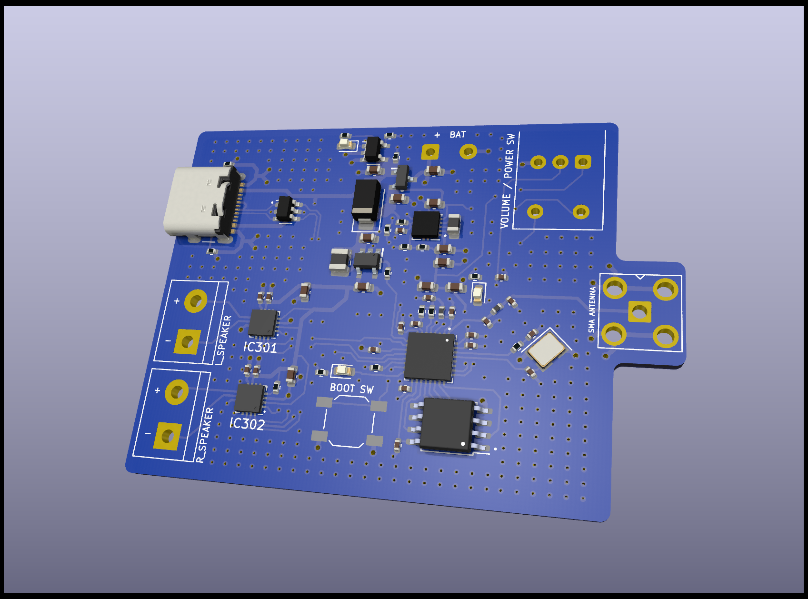
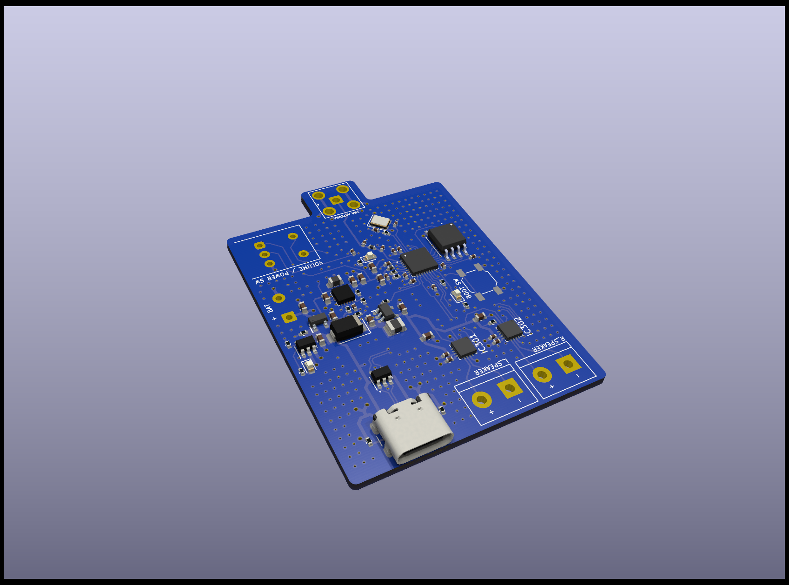

# Open Source Internet Radio Player

## Hardware Specifications:
- **Microcontroller:** ESP32-C3
- **Input Voltage:** 5V / Single Cell Li-ion Battery
- **Flash Memory:** 32Mbit QSPI
- **Antenna Connector:** SMA
- **Controls:** Power On/Off and Volume Adjust Potentiometer
- **Connectivity:** USB Charging / Programming (USB Type C)
- **Audio Output:** Dual Speaker Output (each 3W max)
- **Indicators:** 3x LED Identifiers for WIFI/PLAYING/CHARGING

## Overview:

This hardware design represents an open-source Internet Radio Player that offers an user-friendly programming experience and ease of use. Users can power the device with a 5V input or a single-cell Li-ion battery for on-the-go usage. The ESP32-C3 microcontroller, coupled with 32Mbit QSPI Flash Memory, enables plenty of memory for customizing your radio streaming experience.

## Features:
- **Wireless Connectivity:** Utilize the 2.4GHz SMA Antenna Connector for stable wireless connections.
- **User Controls:** Conveniently manage power and volume with only one potentiometer.
- **USB Compatibility:** Charge the battery or program the microcontroller through the USB Type C connector.
- **Audio Output:** Enjoy rich sound with dual speaker outputs, each capable of 3W maximum power.
- **Status Indicators:** Easily identify the device's status with LED indicators for Wi-Fi connection, streaming, and charging.

## Programming:
To customize your listening experience, input your WiFi credentials and preferred radio station during the programming phase. This process allows users to enjoy online radio seamlessly.

## Development Status:
The project is currently in the initial development and review phase. The first revision of the board is in the manufacturing process with JLCPCB. Upon arrival, extensive testing and further software development will be carried out to enhance functionality and address any potential issues.

Your contributions and feedback are welcome as we strive to create an exceptional open-source Internet Radio Player.

*Note: Please check back for updates and feel free to contribute to the project.*
