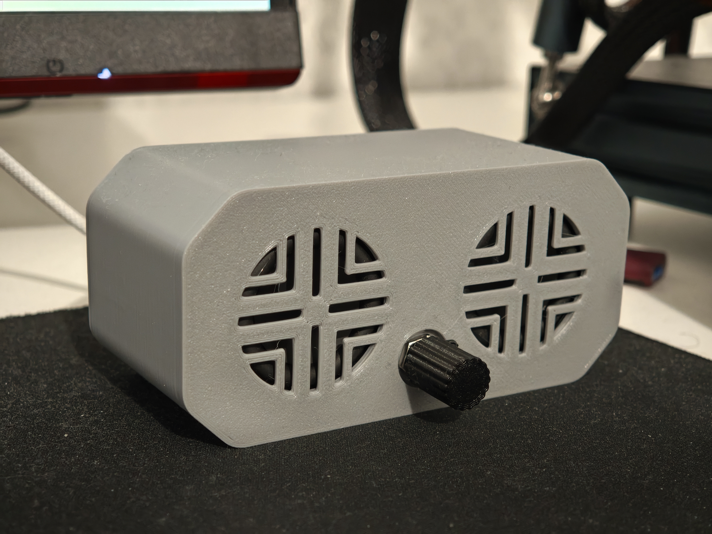
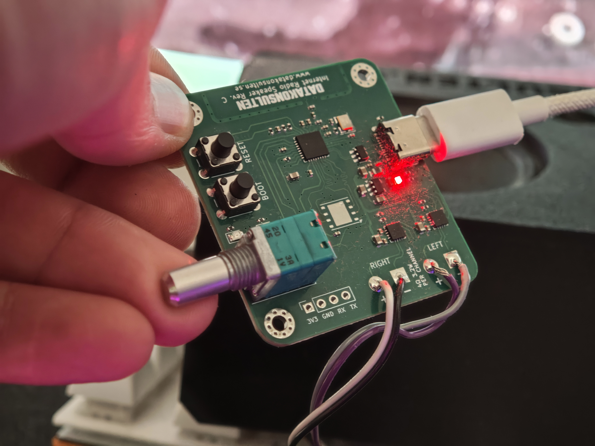

# Open Source Internet Radio Player

  

## Hardware Specifications

- **Microcontroller:** ESP32-C3
- **Power Supply:** 5V/0.5A (USB Type-C, ~2.5W)
- **Flash Memory:** 4Mbit QSPI (on-chip)
- **Antenna:** Integrated PCB antenna
- **Controls:** Power switch and analog volume potentiometer
- **Audio Output:** Dual speaker output (3.2W max per channel)
- **Indicators:** 3x LEDs (Wi-Fi, Playback, Power)

## Description

This project is a compact, ESP32-C3-based Internet Radio Player designed for ease of use and straightforward integration. The device supports Wi-Fi streaming of MP3 audio and includes basic control via a single potentiometer and button. Audio output is handled via I2S to a stereo amplifier. 

The hardware includes onboard status LEDs and is powered via USB Type-C. It's suitable for low-power audio streaming applications, DIY audio projects, or integration into custom enclosures.

## Features

- 2.4 GHz Wi-Fi support using the built-in PCB antenna
- Minimal controls for simple user interaction
- USB Type-C programming and power interface
- Stereo speaker output via digital I2S
- LED indicators for connection and playback status

## Firmware and Usage

The firmware is located in the `Firmware/` directory and is built using the Arduino framework. Upload it via the Arduino IDE or other compatible tools. 

### Initial Setup

1. Flash the firmware to the ESP32-C3.
2. On first boot, the device creates a Wi-Fi Access Point.
3. Connect to the AP to configure the Wi-Fi credentials and stream URL.
4. After setup, the device reboots into streaming mode.

## Status

- Current hardware revision is stable and has been tested.
- The device is functional and ready for personal assembly or integration.
- Further development (BLE config, web UI, OTA, etc.) is planned or ongoing.

## Contributions

Pull requests, issue reports, and improvements are welcome. Make sure to open issue before to discuss changes.
